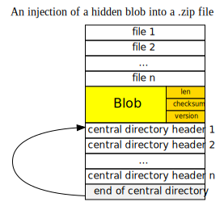

# Zipography

Steganography with zip archives: hide a blob of data within an
archive. For typical file archivers (7-zip, WinRAR, File Roller, &c) or
file managers (Windows Explorer), the blob is invisible.

    $ gem install zipography

Limitations:

* single blob only (but you can just add another .zip as a blob);
* doesn't work w/ zip64 files (this means ~4GB max for an archive+blob
  combo).

## How does it work?

A blob is injected after a file section right before the 1st *central
directory header*. After that, a pointer in an *end of central
directory* record is updated to compensate the shift of the *central
directory header*.

## Usage

Say we have a .zip that contains 2 files:

~~~
$ du orig.zip
12K     orig.zip

$ bsdtar tf orig.zip
The Celebrated Jumping Frog of Calaveras County.txt
What You Want.txt
~~~

Inject a picture into the archive:

    $ zipography-inject orig.zip blob1.png > 1.zip

(On Windows, use `-o 1.zip`, instead of a redirection.)

Is it visible? It isn't:

~~~
$ bsdtar tf 1.zip
The Celebrated Jumping Frog of Calaveras County.txt
What You Want.txt

$ du 1.zip
30K     1.zip
~~~

(`unzip -l` prints the same, but in a much verbose form.)

Check if we have the picture in the archive:

~~~
$ zipography-info 1.zip
Payload size:    18313
Adler32:         0x6812d9f
Blob version:    1
Valid:           true
~~~

Extract it:

~~~
$ zipography-extract 1.zip > 1.png
$ xdg-open !$
~~~

## License

MIT.
